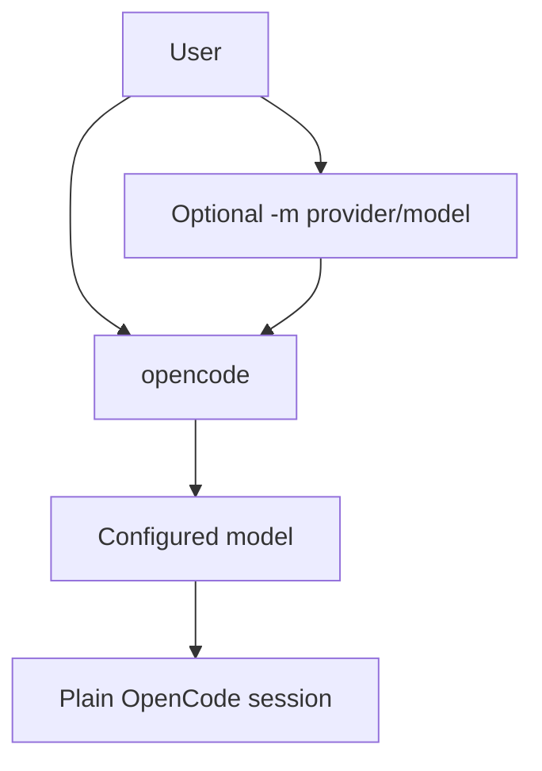

# Workflow Diagram

```mermaid
flowchart TD
    U[User] --> O[opencode]
    O --> M[Configured model]
    U --> OV[Optional -m provider/model]
    OV --> O
    M --> T[Plain OpenCode session]
```

OpenCode starts with the configured default model. Use `opencode -m <provider/model>` to override it per session.
